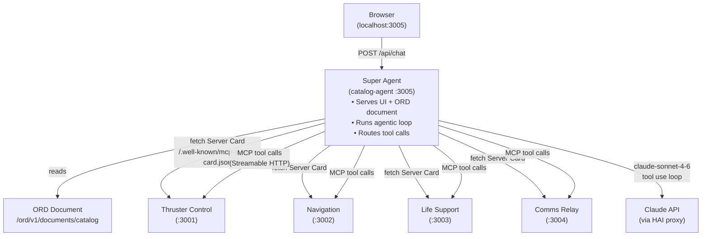
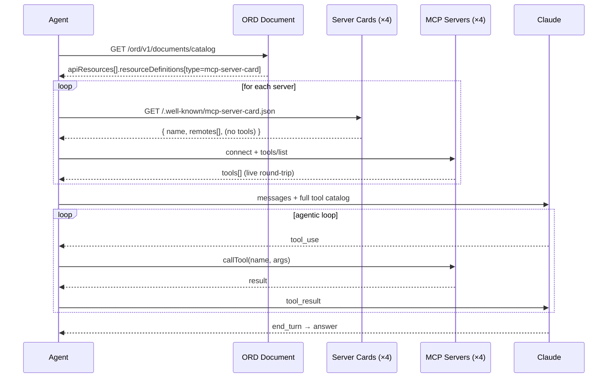
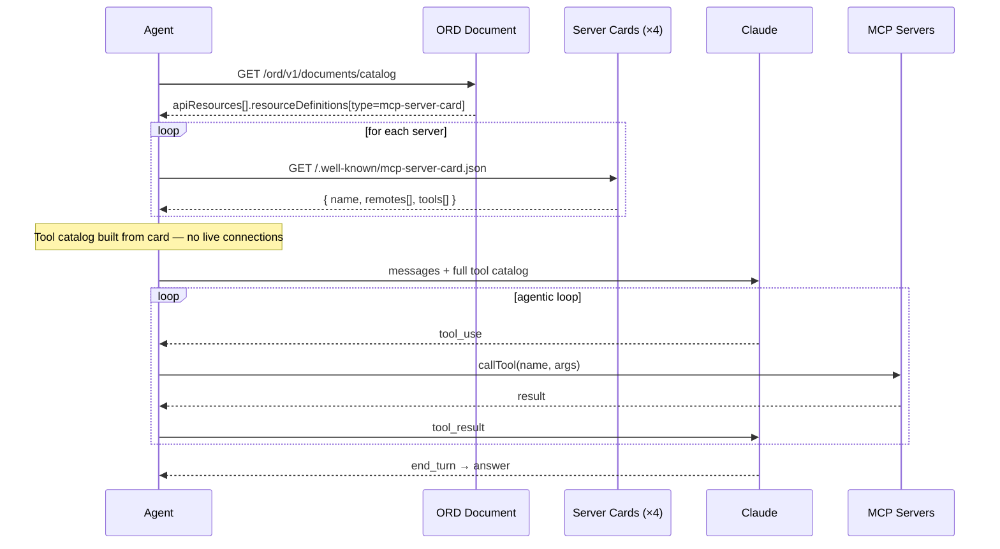

# ORD MCP Server Card Demo

A live demonstration of [MCP Server Cards](https://github.com/modelcontextprotocol/ext-server-card) combined with [Open Resource Discovery (ORD)](https://open-resource-discovery.org) for agent-driven tool discovery — built for MCPCon Amsterdam 2026.

The demo shows the same AI agent solving spaceship emergencies in two modes side-by-side: one where the Server Card carries static tool metadata (right panel), and one where it does not (left panel). The contrast shows the real cost of blind discovery.

---

## What it demonstrates

| | Left panel — no tool metadata | Right panel — with tool metadata |
| --- | --- | --- |
| **Server Card** | `/.well-known/mcp-server-card.json` — server identity, remote URL, no tools | Same card, plus full `tools[]` array |
| **Discovery** | Must connect to every server and call `tools/list` to learn what it can do | Reads tools directly from the card — zero live connections |
| **Agent cost** | 4 extra MCP round-trips before the first Claude call | Immediate — catalog built from static metadata |
| **End result** | Same actions taken, same answer | Same actions taken, same answer |

The point: tool metadata in the Server Card lets an agent, registry, or orchestrator know what a server does **before connecting** — the same way OpenAPI lets you understand an API before calling it.

---

## Architecture



---

## Discovery flow

### Left panel — no tool metadata



### Right panel — with tool metadata



---

## The four MCP servers

Each server simulates a spaceship subsystem with three tools:

| Server | Port | Tools |
| --- | --- | --- |
| **Thruster Control** | 3001 | `check_thruster_status`, `adjust_thrust_level`, `emergency_shutdown` |
| **Navigation** | 3002 | `get_current_position`, `plot_course`, `check_eta` |
| **Life Support** | 3003 | `get_life_support_status`, `adjust_oxygen_level`, `vent_co2` |
| **Comms Relay** | 3004 | `check_signal_strength`, `scan_frequencies`, `send_distress_signal` |

All four expose a Server Card at `/.well-known/mcp-server-card.json` and an MCP endpoint at `/mcp`.
The ORD document at `http://localhost:3005/ord/v1/documents/catalog` links to all four cards.

---

## Running the demo

### Prerequisites

- Docker Desktop
- An Anthropic API key (or SAP HAI proxy token)

### Start

```powershell
# Set your API key
$env:ANTHROPIC_AUTH_TOKEN = "your-key-here"

# Build and start all containers
cd demo
docker compose build --no-cache
docker compose up
```

Open **[http://localhost:3005](http://localhost:3005)** in your browser.

### Restart after changes

```powershell
docker compose down
docker compose build --no-cache
docker compose up
```

### ORD document

Browse the machine-readable service catalog at:
**[http://localhost:3005/ord/v1/documents/catalog](http://localhost:3005/ord/v1/documents/catalog)**

Individual server cards:

- [localhost:3001/.well-known/mcp-server-card.json](http://localhost:3001/.well-known/mcp-server-card.json)
- [localhost:3002/.well-known/mcp-server-card.json](http://localhost:3002/.well-known/mcp-server-card.json)
- [localhost:3003/.well-known/mcp-server-card.json](http://localhost:3003/.well-known/mcp-server-card.json)
- [localhost:3004/.well-known/mcp-server-card.json](http://localhost:3004/.well-known/mcp-server-card.json)

---

## Demo scenarios

The UI includes seven pre-built scenarios that exercise different subsets of the server fleet:

| Scenario | Servers involved |
| --- | --- |
| Thruster overheating | Thruster Control |
| CO2 critical | Life Support |
| Depart to Mars | Navigation + Thruster Control |
| Contact lost + thrusters failing | Comms Relay + Thruster Control |
| Crew safety check | Life Support + Comms Relay |
| Mission readiness | Navigation + Life Support + Thruster Control |
| Full system check | All four servers |

Multi-server scenarios are where the discovery overhead difference is most visible: the left panel must make 4 sequential `tools/list` calls before Claude sees a single tool, while the right panel starts immediately.

---

## Project structure

```text
ord-mcp-server-card-demo/
├── spaceship-app/          # Single Node.js app, runs as 4 MCP servers
│   └── src/
│       ├── servers/        # thruster.ts, navigation.ts, lifeSupport.ts, comms.ts
│       └── shared/         # createServer.ts — ORD + Server Card + MCP endpoint
├── super-agent/            # Catalog agent: UI, ORD router, agent logic
│   └── src/
│       ├── agent.ts        # Two-mode discovery + agentic loop
│       ├── catalog.ts      # ServerCard fetch + type
│       ├── config.ts       # Env config (ports, URLs, API key)
│       ├── ordRouter.ts    # ORD well-known + catalog document endpoints
│       └── ui.ts           # Single-file HTML/CSS/JS demo UI
└── demo/
    └── docker-compose.yml  # 5 containers: 4 spaceship servers + catalog-agent
```

---

## Key concepts

**MCP Server Card** — A static JSON document at `/.well-known/mcp-server-card.json` that describes an MCP server: its identity, remote endpoints, and optionally its tools. Analogous to an OpenAPI document for REST APIs. Defined in [`modelcontextprotocol/ext-server-card`](https://github.com/modelcontextprotocol/ext-server-card).

**Open Resource Discovery (ORD)** — A protocol for machine-readable self-description of system resources. Here the Super Agent publishes an ORD document listing all four spaceship servers as `apiResources`, each with a `resourceDefinitions` entry pointing to its Server Card. Spec: [open-resource-discovery.org](https://open-resource-discovery.org).

**Streamable HTTP transport** — The MCP transport used for all tool calls in this demo. Each call creates a fresh connection; no persistent session.

---

## Related

- [MCP Server Card spec](https://github.com/modelcontextprotocol/ext-server-card)
- [GitHub issue #30 — Add optional tool metadata to Server Card](https://github.com/modelcontextprotocol/ext-server-card/issues/30)
- [Open Resource Discovery specification](https://open-resource-discovery.org)
- [MCP Server Card UI playground](https://open-resource-discovery.github.io/mcp-server-card-ui/playground/)
